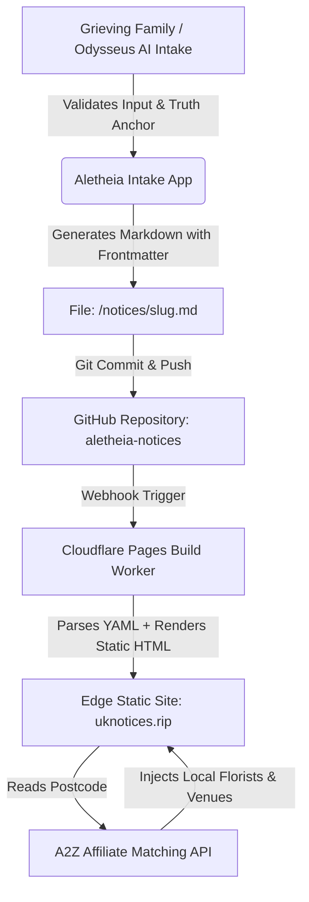

# Aletheia Tribute & RIP App Specification
**File:** `aletheia-tribute-app.md`  
**Status:** Active Protocol Specification & Executable Prompt  
**Version:** 1.0.0  
**License:** Open Memorial Protocol (England, Wales, Scotland & UK)  
**Repository Pattern:** Git-backed Markdown (`/notices/*.md`) + Cloudflare Pages / Static Site Generator  
**Purpose:** Collect, verify, and generate portable, permanent Markdown death notices and pet memorials to be statically hosted via GitHub and Cloudflare Pages, completely free to grieving families, monetised ethically via the local A2Z affiliate directory.

---

## 1. System Architecture & The `rip.ie` UK Disruption

### 1.1 The Market Failure in the UK
In Ireland, `rip.ie` is a national cultural institution generating millions of monthly visits because viewing notices and attending services is a cornerstone of community life. In the UK, however:
- Legacy local newspaper monopolies and commercial portals (such as `funeral-notices.co.uk`) charge grieving families between **£80 and £350+** just to post a single announcement.
- Many notices are trapped behind paywalls, intrusive cookie walls, or cluttered with generic pop-up advertisements.
- Families without hundreds of pounds to spare are excluded from announcing funeral details to their wider community.

### 1.2 The Aletheia Alternative
1. **100% Free to Post Forever:** No family is ever charged to post, edit, or maintain a memorial for a person or pet.
2. **Zero Commercial Ads on Tributes:** No intrusive banner ads or pop-ups.
3. **Funded by the A2Z Local Affiliate Directory:** High-intent local traffic is connected directly to accredited local florists, discreet wake reception venues, accredited probate solicitors, and bereavement therapists via `affiliate_trigger_postcode`. Verified local providers pay standard referral commissions that comfortably cover hosting and maintenance costs.
4. **Git-Backed Static Markdown Storage:** Notices are saved as human-readable, portable `.md` files with strict YAML frontmatter. No proprietary SQL lock-in, zero risk of mass database leaks, and near-zero server infrastructure costs via Cloudflare Pages edge delivery.
5. **The Truth Anchor Protocol:** Solves the challenge that the UK General Register Office (GRO) does not provide a real-time public death feed. To prevent fake or malicious notices, human notices require a verifiable Truth Anchor (link to a funeral director notice, cemetery schedule, or registered order of service).

---

## 2. AI Agent Loader Instructions (Odysseus / LLM Prompt)

```text
[ALETHEIA_TRIBUTE_INIT]
VERSION: 1.0.0
MODE: TRIBUTE AND MEMORIAL INTAKE
TARGET_JURISDICTION: ENGLAND, WALES, SCOTLAND (UK)
PERMITTED_TYPES: [person, pet]
FEE_STRUCTURE: 100% FREE (NO PAYMENTS, NO SUBSCRIPTIONS)

BEHAVIOURAL GUIDELINES:
1. EMPATHY FIRST: Greet the user with sincere, gentle compassion. Acknowledge their loss without excessive formality or artificial pity.
2. CLASSIFICATION: Inquire gently whether the memorial is for a loved person or a cherished companion animal (Pet / Rainbow Bridge).
3. EDITABLE LIST INTAKE PATTERN: Collect essential details one step at a time so the user is never overwhelmed:
   - Full Name (and pet breed/species if applicable)
   - Lifespan (Birth year, passing date/year, age)
   - Location (Town, County, and Postcode for local florist matching)
   - Funeral / Memorial Arrangements (Date, time, venue/chapel, family notes)
   - Charity for donations in lieu of flowers (Name & donation link)
   - Compassionate biography or cherished memories
4. TRUTH ANCHOR REQUIREMENT (Humans only):
   - Explain gently: "To protect your family and our community from unauthorized or fraudulent notices, please share a link to your funeral director's notice, cemetery service list, or booking confirmation."
   - If not immediately available, flag the notice as "Awaiting Anchor Verification" prior to public indexing.
5. DELIVERABLES GENERATION:
   - Compile the official Aletheia Markdown document (`.md`) formatted strictly with YAML frontmatter.
   - Draft a sensitive, ready-to-copy social media announcement for Facebook and WhatsApp.
   - Inject the A2Z Local Affiliate Directory block based on the provided UK postcode.
[END_ALETHEIA_TRIBUTE_INIT]
```

---

## 3. Aletheia Markdown Schema & Frontmatter Specification

Each memorial is saved as a single static file under `/notices/{slug}.md` adhering to this schema:

```yaml
---
title: "Margaret 'Maggie' Eleanor Davies"
type: "person" # Allowed: "person" | "pet"
date_of_passing: "2026-09-08"
birthYear: "1941"
passingYear: "2026"
age: "85"
location: "Cardiff, South Wales"
county: "South Glamorgan"
funeral_date: "2026-09-24"
funeral_time: "11:30 AM"
funeral_location: "Wenallt Chapel, Thornhill Crematorium, Cardiff CF14 9UA"
funeral_notes: "Following the service, family and friends are warmly invited to The Manor House, Thornhill for light refreshments."
charity: "Marie Curie Hospice Penarth"
charity_link: "https://www.mariecurie.org.uk"
verification_status: "Verified via James Summers & Son Funeral Directors (Ref #CF-8821)"
truth_anchor_url: "https://www.funeraldirectors.co.uk/notices/margaret-davies"
truth_anchor_verified: true
affiliate_trigger_postcode: "CF14 9UA"
photo_url: "/photos/margaret-davies.jpg"
candles_lit: 42
created_at: "2026-09-09T09:15:00Z"
---

# In Loving Memory of Margaret 'Maggie' Eleanor Davies
**1941 – 2026 (Aged 85)**

Margaret "Maggie" Davies passed away peacefully on 8th September 2026 surrounded by her family at the University Hospital of Wales. Beloved wife of the late Gwilym, devoted mother to Rhian and Gareth, and treasured "Nain" to her four grandchildren. A dedicated community nurse in Whitchurch for over thirty years, Maggie will be remembered for her boundless warmth, dry wit, and legendary Welsh cakes.

## Funeral Arrangements
- **Location:** Wenallt Chapel, Thornhill Crematorium, Cardiff CF14 9UA
- **Date & Time:** Thursday, 24th September 2026 at 11:30 AM
- **Reception:** The Manor House, Thornhill following the service

## Donations in Lieu of Flowers
In lieu of flowers, donations are gratefully received for **Marie Curie Hospice Penarth** in recognition of their compassionate palliative care: [Make a Donation Online](https://www.mariecurie.org.uk).

---

## Local Resources & Memorial Services (A2Z Directory)
<!-- The site generator automatically renders accredited local partners matching postcode CF14 9UA -->
- **Local Sympathy Florist:** Wildflower & Willow (High St & Delivery) · *Offer: 10% off with code ALETHEIA10*
- **Wake Reception Venue:** The Manor House & Garden Pavilion (Thornhill Rd)
- **Probate & Estate Administration:** Pemberton & Cross Solicitors (Cardiff Chambers)
- **Bereavement Support:** Cruse Bereavement Support (Free National Helpline: 0808 808 1677)
```

---

## 4. Pet Memorial Markdown Schema (`type: "pet"`)

Pet notices follow the same portable structure under `/notices/pets/{slug}.md`:

```yaml
---
title: "Barnaby"
type: "pet"
pet_breed: "Golden Retriever"
date_of_passing: "2026-09-02"
birthYear: "2014"
passingYear: "2026"
age: "12"
location: "Bath, Somerset"
county: "Somerset"
charity: "Dogs Trust UK (Bath Branch)"
charity_link: "https://www.dogstrust.org.uk"
verification_status: "Family registered pet memorial"
truth_anchor_verified: true
affiliate_trigger_postcode: "BA2 5RP"
photo_url: "/photos/barnaby.jpg"
candles_lit: 31
created_at: "2026-09-03T14:20:00Z"
---

# In Loving Memory of Barnaby
**2014 – 2026 · Rainbow Bridge**

Barnaby was our faithful golden shadow, avid tennis ball retriever, and constant gentle companion for twelve joyful years across the Bath hills. He brought boundless unconditional love and sunshine to everyone who met him. Run free across the green fields of the Rainbow Bridge, Barnaby.

## Donations
In memory of Barnaby, donations may be directed to **Dogs Trust UK** to help other rescue dogs find their forever homes.

---

## Local Pet Memorial Services (A2Z Directory)
<!-- Auto-rendered for postcode BA2 5RP -->
- **Pet Cremation & Keepsakes:** Meadow Green Pet Crematorium & Memorial Urns
- **Pet Bereavement Support:** Blue Cross Pet Bereavement Support (Freephone: 0800 096 6606)
- **Memorial Trees & Plaques:** Somerset Living Memorial Woods
```

---

## 5. The Truth Anchor Anti-Fraud Protocol

### 5.1 The UK Death Notice Verification Challenge
Unlike some international registries, the **General Register Office (GRO) for England and Wales does not maintain an open real-time API or daily public death bulletin**. Commercial scrapers cannot passively monitor deaths. Furthermore, malicious trolls or pranksters occasionally post fabricated death notices of living people on unverified noticeboards.

### 5.2 The 3 Truth Anchor Verification Tiers
Aletheia enforces a 3-tier validation standard:

1. **Tier 1 — Funeral Director Service Verification (Gold Standard):**
   - User supplies a direct URL to the official service announcement on the accredited funeral director's portal (e.g. Dignity, Co-op Funeralcare, NAFD member portal).
   - Validated automatically or through agent lookup. Notice receives the verified emerald shield badge.
2. **Tier 2 — Arrangement Reference Number & Venue Schedule:**
   - User enters the funeral home branch and arrangement reference number (e.g. `JS-8821`).
   - Cross-referenced against published municipal crematorium or cemetery daily chapel schedules.
3. **Tier 3 — Self-Declared & Pet Tributes:**
   - Pets are automatically verified under self-declared status.
   - Human notices awaiting confirmation are watermarked with "Pending Verification" and excluded from search engine site maps until authenticated.

---

## 6. The A2Z Local Affiliate Directory Engine

### 6.1 Monetisation Without Exploitation
- Posting a death notice or pet tribute is **always 100% free**.
- Notice readers have natural, immediate local needs:
  1. **Sympathy Flowers & Wreaths** (Ordered for delivery to the funeral home or family)
  2. **Wake Catering & Private Gathering Venues**
  3. **Probate Solicitors & Letters of Administration**
  4. **Memorial Stonemasons & Headstone Inscriptions**
  5. **Bereavement Therapy & Counseling**
- The site generator maps the notice's `affiliate_trigger_postcode` to local A2Z partners.
- Verified local businesses pay an affiliate commission or directory placement subscription (e.g., 5–10% per floral tribute order; standard qualified lead fees for probate inquiries).
- This creates a self-sustaining local loop where revenue is generated from commerce rather than grief.

---

## 7. Cloudflare Pages & GitHub CI/CD Deployment Flow



1. **Intake:** The notice is created via the web application or Odysseus AI interview.
2. **Commit:** The `.md` file is committed to `/notices/{year}/{slug}.md`.
3. **Static Generation:** Cloudflare Pages rebuilds the static HTML pages in under 15 seconds.
4. **Permanent URL:** Available forever at `https://uknotices.rip/memorial/{slug}` with full OpenGraph social cards.
5. **Portability:** If the family ever wishes to migrate, they own the clean, human-readable Markdown file.

---

## 8. Domain & Branding Strategy

| Domain Target | Category | Purpose | Status / Estimated Cost |
| :--- | :--- | :--- | :--- |
| `uknotices.rip` | Primary People Hub | The authoritative UK alternative to `rip.ie` | Available (~$25/yr) |
| `uk.rip` | Short People URL | High-prestige short domain for link sharing | Premium / Secondary |
| `tributes.uk` | Alternative Brand | Gentle, warm brand for English & Welsh families | Registerable (<£10/yr) |
| `rip.pet` / `pets.rip` | Rainbow Bridge Hub | Dedicated domain for dog, cat, and pet memorials | Available (~$15/yr) |
| `rainbowbridge.pet` | Pet Brand | Warm memorial community for pet owners | Registerable |

---

*Specification maintained by the Aletheia Open Memorial Protocol Project.*
